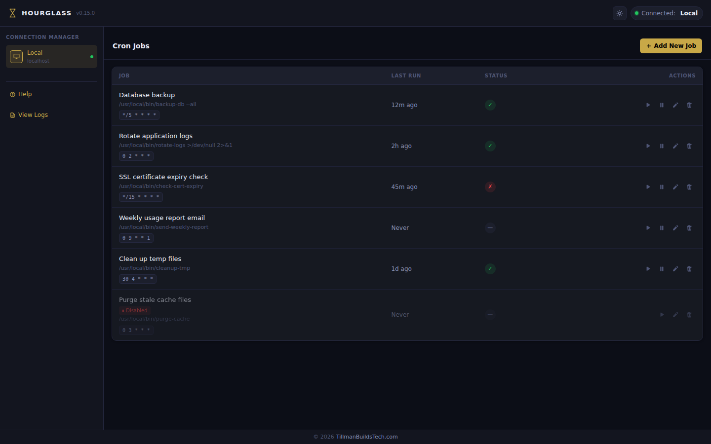
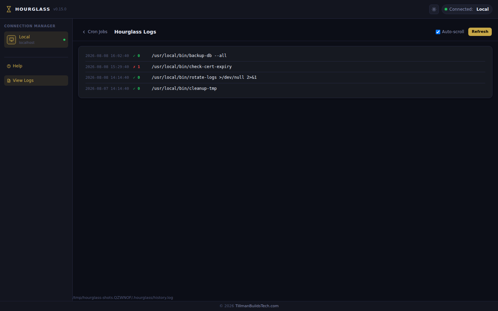

#  Hourglass — Self-Hosted Crontab Manager

**Hourglass** is a lightweight, self-hosted web UI for managing Linux cron jobs. See your scheduled tasks, view execution history, and add/edit/delete jobs without touching the command line.

## Screenshots

Dark mode with a few mock cron jobs (regenerate anytime with `bash scripts/screenshots.sh`):





## Features

- 📋 **View all cron jobs** in a clean table interface
- ⏱️ **See when each job last ran** (tracked automatically by Hourglass)
- ✅ **View exit status** — success or failure at a glance
- ✏️ **Add/edit/delete jobs** through the web UI
- 🌐 **Connection manager** — manage multiple Hourglass instances from one place
- 🤖 **MCP server** — let AI agents (Claude Desktop, Claude Code, etc.) list, create, edit, and delete cron jobs
- 🔒 **No external dependencies** — single binary, runs anywhere
- 🚀 **Auto-tracked execution history** — no setup required
- 📱 **Responsive design** — works on desktop and mobile

## Requirements

- **Linux** (20.04 LTS or newer) or **macOS** (12 Monterey or newer)
- `crontab` installed (included by default on both platforms)
- Optional: Basic auth credentials (for remote access)

## Installation

### Homebrew (macOS)

```bash
brew install TillmanBuildsTech/tap/hourglass
```

This builds Hourglass from source on your machine (Homebrew installs Go and
Node as temporary build dependencies). It only takes a few seconds, and
because the binary is compiled locally rather than downloaded, macOS
Gatekeeper won't flag it with a security warning.

### Download Binary

Download the latest binary for your platform from [GitHub Releases](https://github.com/TillmanBuildsTech/hourglass/releases):

```bash
wget https://github.com/TillmanBuildsTech/hourglass/releases/latest/download/hourglass-linux-amd64
chmod +x hourglass-linux-amd64
sudo mv hourglass-linux-amd64 /usr/local/bin/hourglass
```

### macOS

Download the darwin binary:

```bash
curl -L https://github.com/TillmanBuildsTech/hourglass/releases/latest/download/hourglass-darwin-amd64 -o hourglass
chmod +x hourglass
sudo mv hourglass /usr/local/bin/
```

Or for Apple Silicon:

```bash
curl -L https://github.com/TillmanBuildsTech/hourglass/releases/latest/download/hourglass-darwin-arm64 -o hourglass
chmod +x hourglass
sudo mv hourglass /usr/local/bin/
```

**Note:** macOS may prompt for Full Disk Access the first time Hourglass reads or writes the crontab. Grant access in System Settings → Privacy & Security → Full Disk Access if prompted.

### Or Build from Source

Requires Go 1.21+:

```bash
git clone https://github.com/TillmanBuildsTech/hourglass.git
cd hourglass
go build -o hourglass .
sudo mv hourglass /usr/local/bin/
```

## Usage

### Local Development

```bash
./hourglass
# Opens on http://localhost:8080
```

### Remote Server

```bash
HOURGLASS_BIND=0.0.0.0:8080 \
HOURGLASS_AUTH_USER=admin \
HOURGLASS_AUTH_PASS=secretpass \
./hourglass
```

Then access at `http://your-server:8080` with basic auth.

### Install as a Service (Linux — .deb / .rpm)

Debian/Ubuntu and Fedora/RHEL packages ship a systemd unit and enable the
service automatically. On first install a random password is generated and
printed, and the service starts bound to `0.0.0.0:8080` with mDNS
advertisement, so it is immediately reachable from any device on your LAN:

```
http://hourglass.local:8080     # from any device on the network
http://<this-host>:8080         # from the host itself
```

```bash
# Debian / Ubuntu
sudo dpkg -i hourglass_linux_amd64.deb

# Fedora / RHEL / openSUSE
sudo rpm -i hourglass_linux_amd64.rpm
```

Credentials are saved in `/etc/hourglass.env` (chmod 600) — edit and
`sudo systemctl restart hourglass` to change them. The service installs the
unit to `/usr/lib/systemd/system/hourglass.service`.

The service runs as **root** by default (it manages root's crontab). To run it
as another user instead — managing *that* user's crontab and `~/.ssh` — create
an override drop-in rather than editing the packaged unit (so it survives
upgrades):

```bash
sudo mkdir -p /etc/systemd/system/hourglass.service.d
printf '[Service]\nUser=someuser\nGroup=someuser\n' \
  | sudo tee /etc/systemd/system/hourglass.service.d/user.conf
sudo systemctl daemon-reload && sudo systemctl restart hourglass
```

The `curl | sh` installer also accepts `HOURGLASS_USER=someuser` to do this for
you; the `.deb`/`.rpm` postinstall honors it when passed to the package manager.

For distros without packages:

```bash
curl -fsSL https://github.com/TillmanBuildsTech/hourglass/releases/latest/download/install.sh | sh
```

### Install as a Service (macOS — Homebrew)

```bash
brew install TillmanBuildsTech/tap/hourglass
brew services start hourglass
```

The formula runs Hourglass as a launchd agent (`keep_alive`, logs in
`$(brew --prefix)/var/log/hourglass.log`). By default it binds
`0.0.0.0:8080` and advertises itself over mDNS, so it is immediately
reachable at `http://hourglass.local:8080` from any device on your LAN.
On first run a random password is generated and printed to the log
(saved in `~/.hourglass/auth.env`) — the same Home Assistant-style
zero-config model the Linux packages use. If you prefer loopback-only,
set `HOURGLASS_BIND=127.0.0.1:8080` in
`~/Library/LaunchAgents/homebrew.mxcl.hourglass.plist` (no credentials
needed for loopback), then `brew services restart hourglass`.

### LAN access & mDNS (both platforms)

With `HOURGLASS_BIND=0.0.0.0:8080` and credentials set, Hourglass advertises
itself over mDNS (Bonjour) so `http://hourglass.local:8080` resolves from any
device on the network. The advertised name defaults to `hourglass`
(`HOURGLASS_MDNS_NAME` to override); disable with `HOURGLASS_MDNS=0`.

**Same-host access:** the HTTPS endpoint is served on the same port it binds,
and plain-HTTP requests to that port are auto-redirected to `https://`. So
`http://localhost:8080`, `http://192.168.1.241:8080`, and
`http://hourglass.local:8080` all land on the valid HTTPS endpoint (the TLS
cert covers `hourglass.local`, `localhost`, `127.0.0.1`, and `::1`).

**How the name is advertised, per build:**
- **macOS via Homebrew (cgo build):** registers `hourglass.local` directly
  with the system `mDNSResponder` (the Bonjour API), so the Mac itself AND
  other LAN devices resolve it — the same-host mDNS loopback quirk does not
  apply. Conflict handling is done by the OS.
- **Linux, Windows, and CGO_ENABLED=0 release binaries:** a self-contained
  multicast responder advertises `<name>.local` to other LAN devices. The
  host itself uses `localhost` (covered by the TLS cert) — macOS
  `mDNSResponder` may not resolve the host's own `.local` announcement.

If another device on the LAN is already answering `<name>.local` (e.g. a
second Hourglass, or the same name in use by another service), Hourglass
probes for the conflict on startup and advertises as `<name>-2.local`,
`<name>-3.local`, … instead (the Home Assistant model) — so multiple
instances on one network stay individually reachable rather than fighting
over one name. Watch the startup log to see which name was chosen.

## Connection Manager

Hourglass includes a built-in connection manager for accessing multiple Hourglass instances from a single UI.

### For Local-Only Instances

When Hourglass is running on `127.0.0.1` or `localhost`, the connection manager only shows the local connection and prevents adding remote connections. This is the default for local development or SSH tunnel access (see below).

### For Remote-Capable Instances

When Hourglass is bound to `0.0.0.0` or a specific hostname, you can add and manage multiple server connections:

1. Click "Manage Connections" in the top-right corner
2. Click "+ Add Connection"
3. Enter the hostname/IP, port, and optional label
4. Click "Save" to store the connection
5. Use "Connect" to switch between saved connections

**Note:** Only one connection can be active at a time. The UI will reload when you switch connections.

### SSH Tunneling for Remote Access

For secure remote access, use SSH port forwarding. This is the recommended approach for accessing Hourglass from outside your network:

```bash
ssh -L 8080:localhost:8080 user@remote-server
```

Then visit `http://localhost:8080` on your local machine.

**Advantages:**
- Secure encrypted connection
- No need to expose Hourglass to the internet
- Can run Hourglass on localhost without remote binding
- Works with key-based authentication

**For systemd-managed instances:**

Create an SSH tunnel helper script:

```bash
#!/bin/bash
ssh -L 8080:localhost:8080 user@remote-server
```

Then use it in your local shell profile or automation.

**With Authentication:**

If you've configured basic auth on Hourglass:

```bash
ssh -L 8080:localhost:8080 user@remote-server
# Visit http://localhost:8080 and enter credentials
```

## MCP Server

Hourglass can run as a [Model Context Protocol](https://modelcontextprotocol.io) server over stdio, so AI agents can list, create, edit, and delete cron jobs directly:

```bash
./hourglass --mcp
```

This starts Hourglass in stdio JSON-RPC mode instead of the web UI — it's meant to be spawned as a subprocess by an MCP client, not run interactively. It operates on the local crontab (the same one `./hourglass` manages by default) and exposes these tools:

| Tool | What it does |
|------|--------------|
| `list_cron_jobs` | List all jobs with their index, schedule, command, comment, active state, and last run result |
| `create_cron_job` | Add a new job (`schedule`, `command`, optional `comment`) |
| `update_cron_job` | Replace the job at `index` with a new `schedule`/`command`/`comment`/`inactive` |
| `delete_cron_job` | Delete the job at `index` |
| `validate_cron_schedule` | Check a 5-field schedule string without writing anything |

Indices come from `list_cron_jobs` and can shift after any add/delete, so agents should re-list before acting on a stale index.

**Local and remote:** the MCP server uses the same `cron.Manager` as the web UI and restores the saved active connection before entering MCP mode. If the active connection is a remote SSH host, every tool operates on that host's crontab; switch back to Local (or to a different connection) and the same tools follow. `HOURGLASS_CRONTAB_USER` and `HOURGLASS_CRONTAB_FILE` also apply in MCP mode.

### Claude Desktop / Claude Code

Add Hourglass to your MCP client's config (e.g. `claude_desktop_config.json`, or via `claude mcp add`):

```json
{
  "mcpServers": {
    "hourglass": {
      "command": "/usr/local/bin/hourglass",
      "args": ["--mcp"]
    }
  }
}
```

### Hermes Agent

Add it under `mcp_servers` in `~/.hermes/config.yaml` (any profile you run — `hermes config path` shows the active file):

```yaml
mcp_servers:
  hourglass:
    command: /usr/local/bin/hourglass
    args: ["--mcp"]
    timeout: 120
    connect_timeout: 60
    enabled: true
```

Verify the connection from the terminal, then start a new session (MCP tools load at session startup):

```bash
hermes mcp list                # hourglass should appear
hermes mcp test hourglass      # "Connected", 5 tools discovered
```

Tools show up as `mcp__hourglass__list_cron_jobs`, `mcp__hourglass__create_cron_job`, `mcp__hourglass__update_cron_job`, `mcp__hourglass__delete_cron_job`, `mcp__hourglass__validate_cron_schedule`.

### Example agent interactions

Once connected, an AI agent can be asked, in plain language:

- *"List my cron jobs"* → `list_cron_jobs`
- *"Add a job to back up the database every day at 2am"* → `create_cron_job` with `0 2 * * *`
- *"Disable the enrichment job"* → `update_cron_job` with `inactive: true`
- *"Is `99 99 * * *` valid?"* → `validate_cron_schedule` (rejected before anything is written)

The tools run the same schedule validation and read-before-write safety as the web UI, so a bad schedule is caught before it reaches the system crontab.

## Configuration

### Checking the Version

The running version is shown in the web UI header, and available via:

```bash
./hourglass --version
curl http://localhost:8080/api/version
```

### Environment Variables

| Variable | Default | Purpose |
| --- | --- | --- |
| `HOURGLASS_BIND` | `0.0.0.0:8080` | Server bind address. LAN-reachable by default so `hourglass.local` works out of the box; use `127.0.0.1:8080` for loopback-only |
| `HOURGLASS_AUTH_USER` | (none) | Basic auth username. **Required for non-loopback binds** |
| `HOURGLASS_AUTH_PASS` | (none) | Basic auth password. **Required for non-loopback binds** |
| `HOURGLASS_ALLOW_INSECURE` | (none) | `1` serves without auth on non-loopback binds (dangerous — explicit opt-in only) |
| `HOURGLASS_MDNS` | `1` | Advertise `hourglass.local` over mDNS/Bonjour (skipped on loopback binds; `0` disables) |
| `HOURGLASS_MDNS_NAME` | `hourglass` | mDNS hostname (the `hourglass` in `hourglass.local`) |
| `HOURGLASS_TLS` | `auto` | Local HTTPS mode: `auto`, `1` (force), `0` (off) |
| `HOURGLASS_CRONTAB_USER` | (none) | Manage a **specific user's** crontab via `crontab -u <user>` (requires root). Set this when the Hourglass process runs as root (e.g. a launchd/systemd service) but the jobs live under another account — classic macOS setup where root's crontab is empty but the console user's has all the jobs. History/log paths follow the target user's home. |

> **Security:** The web UI can execute arbitrary shell commands (Run now,
> cron writes). Hourglass **never starts unauthenticated on a non-loopback
> bind** (`0.0.0.0` or a LAN IP): if `HOURGLASS_AUTH_USER`/`HOURGLASS_AUTH_PASS`
> are not set, a random password is generated on first run, saved to
> `~/.hourglass/auth.env` (mode 0600), and printed at startup — so the
> default LAN install is both zero-config and protected. Set
> `HOURGLASS_ALLOW_INSECURE=1` to explicitly opt out (dangerous: an
> unauthenticated LAN-accessible instance is a remote code execution hole).

### HTTPS for `hourglass.local` (no more browser warnings)

**Short version: it just works.** On first run Hourglass generates a
per-machine root CA and a certificate for `hourglass.local`, installs the
CA into your OS trust store (Linux `update-ca-certificates`, macOS
keychain, Windows cert store), and serves HTTPS. Your browser shows a
valid lock at `https://hourglass.local:8080` — no self-signed warning,
nothing to configure.

**Why not a Let's Encrypt certificate?** Let's Encrypt (and every public
CA) cannot issue for `hourglass.local`: `.local` is reserved by RFC 6762
for mDNS and does not exist in the public DNS, so no ACME challenge can
ever validate it, and the CA/Browser Forum Baseline Requirements forbid
public certificates for internal names (browsers distrust them). A
locally-generated, locally-trusted root CA is the only way a `.local`
name can get a valid certificate — it's the same model mkcert and
Tailscale use.

What happens in practice, per machine:

- **First run** (as root/admin — the packaged systemd service already
  runs as root): certs are generated in `~/.hourglass/tls/`
  (`ca.pem`, `ca-key.pem`, `hourglass.pem`, `hourglass-key.pem`), the CA
  is added to the OS trust store, and Firefox profiles are configured to
  trust the OS store too (`security.enterprise_roots.enabled`). The
  server then advertises `https://hourglass.local:8080` via mDNS.
- **Not root/admin?** The CA can't be installed, so Hourglass falls back
  to plain HTTP and logs instructions — it never shows you a scary
  untrusted-cert warning by surprise. Run `sudo hourglass -install-ca`
  once, restart, and HTTPS turns on.
- **Other devices on your LAN** (phone, laptop): fetch the CA once from
  the running instance and trust it — `curl -k
  https://hourglass.local:8080/ca.pem` (or visit `/ca.pem` in a browser)
  — and `https://hourglass.local` is valid there too.

`HOURGLASS_TLS` overrides the behavior: `HOURGLASS_TLS=0` keeps plain
HTTP exactly like older versions; `HOURGLASS_TLS=1` serves HTTPS even
when the CA isn't trusted yet (for admins who install trust separately).
The leaf certificate covers `<mDNS-name>.local`, `localhost`, and the
loopback IPs, and is renewed automatically when it gets close to expiry
(the root CA lives for 10 years).

### Running as Non-Root

Hourglass must run as a user that can read the system crontab. On Linux, add your user to the `root` group or run as root:

```bash
sudo usermod -aG root $USER
newgrp root
./hourglass
```

Or run with sudo:

```bash
sudo ./hourglass
```

## Troubleshooting

### "Cannot read crontab: permission denied"

The running user doesn't have crontab permissions.

**Solution:** Run as root or add user to root group:
```bash
sudo hourglass
# or
sudo usermod -aG root $USER
newgrp root
hourglass
```

### Last run / status never shows up

Hourglass tracks execution history by wrapping each job's command so it logs its exit code and timestamp to `~/.hourglass/history.log` (the home directory of whichever user's crontab is being managed — the local user, or the SSH-remote user). If that user has no writable `$HOME`, history silently stays empty. Jobs added outside Hourglass (directly via `crontab -e`) aren't wrapped either, so they won't show history until edited and saved through Hourglass.

**Solution:** Make sure the crontab owner has a writable home directory.

### "No crontab found"

The system doesn't have any cron jobs yet.

**Solution:** Create one in Hourglass, or via crontab:
```bash
crontab -e
```

### "Address already in use :8080"

Another service is using port 8080.

**Solution:** Use a different port:
```bash
HOURGLASS_BIND=127.0.0.1:9000 ./hourglass
```

### UI not updating or showing "Loading..."

Check if the backend API is running. Open browser DevTools (F12) and check the Network tab for failed `/api/cron` requests.

**Solution:** Restart Hourglass and check logs.

### "Operation not permitted" on macOS

macOS requires Full Disk Access for crontab operations.

**Solution:** Grant Full Disk Access to your terminal app (or to the `cron` binary):
1. Open System Settings → Privacy & Security → Full Disk Access
2. Add your terminal application (Terminal.app, iTerm2, etc.)
3. Restart Hourglass

### Table shows only remote jobs, or is empty while `crontab -e` shows jobs

Hourglass displays **one source of truth at a time**: whatever the active
connection is — Local, or the last remote connection you connected to. It
does not merge local + remote jobs.

1. **Check the "Connected:" pill in the header.** If it shows a remote label
   (e.g. a Coolify host), the table is showing *that* machine's crontab —
   your local jobs are not being ignored, they're just not the active source.
   Open the Connection Manager sidebar and click **Connect** on the *Local*
   card (or the `Connect` button next to Local in the sidebar) to switch back.
2. **Local shows empty but `crontab -e` (as your user) shows jobs?** The
   Hourglass process is probably running as a different user than the one
   whose crontab has the jobs. `crontab -l` only ever returns the crontab of
   the user the *process* runs as — on macOS that's the console user for
   `brew services`, but **root if you started Hourglass with `sudo`** (root's
   crontab is empty by default). Fix: run Hourglass as your user, or keep it
   as root and set `HOURGLASS_CRONTAB_USER=<your-username>` so Hourglass
   reads *your* crontab via `crontab -u <user>` (requires root, so it works
   with launchd/systemd services too):
   ```bash
   HOURGLASS_CRONTAB_USER=macuser ./hourglass
   ```
3. **A saved remote connection keeps coming back?** Hourglass restores the
   last active connection on startup by design. Switch back to Local once and
   it stays Local until you connect to a remote again.

## Limitations

- **Single Admin** — Only one person should edit jobs at a time. Concurrent edits may overwrite each other.
- **Launchd Not Supported** — Hourglass manages crontab jobs (which macOS still supports). Native `launchd` integration is planned for a future release.
- **Windows Not Supported** — Windows has no `crontab`; not currently planned.
- **Hourglass-Managed Jobs Only** — Only jobs added/edited through Hourglass are wrapped to record execution history. Jobs added directly via `crontab -e` won't show a last-run status until saved through Hourglass.
- **History Shows Latest Run Only** — Hourglass keeps the most recent execution per job, not a full history log (the `~/.hourglass/history.log` file itself does accumulate every run until you rotate or clear it).
- **No Clustering** — Each instance manages its own crontab.

## Roadmap

Planned work, roughly in priority order:

- **Hardening for exposed instances** — rate limiting, CSRF protection, and an audit trail for cron changes (credentials are already auto-generated for LAN binds).
- **Operational polish** — structured logging, graceful shutdown, and a deeper `/health` endpoint (crontab readability, history-log access, disk space).
- **Backup & restore** — export/import of the crontab around writes (today: `crontab -l > backup.cron`).
- **Native macOS launchd support** — manage launchd jobs in addition to crontab.
- **Interactive schedule builder** — a guided form with natural-language confirmation and a preview of upcoming runs, so no cron syntax knowledge is needed.
- **Job execution features** — dependency tracking, maintenance windows, email alerts on job failure.
- **Clustering** — multiple instances coordinating on the same crontab (currently single-admin).

## Architecture

**No External Dependencies** — Hourglass uses only Go stdlib:

- **HTTP Server:** `net/http`
- **Crontab I/O:** `os/exec` (runs `crontab` command)
- **Execution History:** Each managed job's command is wrapped so it appends its exit code and timestamp to `~/.hourglass/history.log`; Hourglass reads that file back (via the same local/SSH executor used for crontab I/O) instead of parsing system logs, since cron itself never reports exit codes to syslog.
- **UI:** Single HTML shell with generated CSS/JS (Tailwind + vanilla JavaScript, built from `ui/src` via `npm run build` — no runtime dependencies)

See [Design.md](Design.md) for detailed architecture decisions.

## Development

See [CLAUDE.md](CLAUDE.md) for development setup and contribution guidelines.

## License

MIT License — See LICENSE file for details.

## Contributing

Contributions welcome! Please:

1. Fork the repository
2. Create a feature branch
3. Write tests for new features
4. Ensure all tests pass: `go test ./...`
5. Submit a pull request

## Support

Found a bug? Have a feature request? Open an issue on GitHub:
https://github.com/TillmanBuildsTech/hourglass/issues

---

**Built with Go • Single Binary • Zero Setup**
